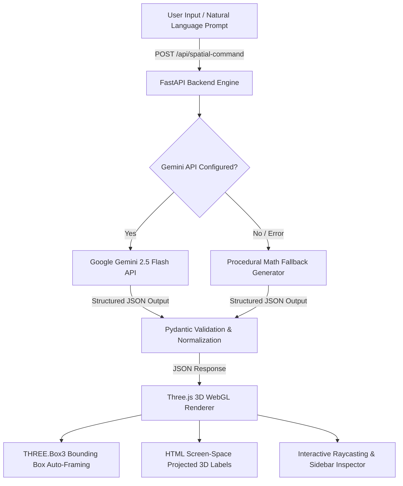

# 🌌 Spatial MindStudio AI

> **3D Knowledge Constellation Synthesizer Powered by Google Gemini API & WebGL**


---

## 💡 Executive Overview & Problem Statement

Traditional 2D mind maps and hierarchical diagrams fail to convey complex, multi-dimensional relationships across dense knowledge networks. Information overflow leads to visual clutter, poor spatial recall, and cognitive fatigue.

**Spatial MindStudio AI** transforms flat text and complex natural language prompts into **immersive 3D knowledge constellations**. Powered by **Google Gemini API** (`gemini-2.5-flash`), the system parses unstructured concepts, automatically determines optimal 3D coordinates `[x, y, z]`, constructs semantic connections, and renders real-time WebGL interactive graphs with zero overlap and dynamic camera framing.

---

## ⚡ Core Features & Innovations

- 🧠 **Structured Gemini 3D Engine**: Leverages Google Gemini's `response_mime_type="application/json"` with strict schema enforcement to generate graph topologies, colors, connections, and camera targets.
- 📐 **Adaptive Coordinate Normalization & Auto-Framing**: Dynamically scales incoming coordinates and uses `THREE.Box3` bounding-box math to automatically adjust camera FOV and position so every node is perfectly visible upon generation.
- ✨ **Volumetric WebGL Graphics**: Spherical glow nodes, volumetric cylinder connection beams, particle space dust, and emissive lighting effects built with Three.js and OrbitControls.
- 🔍 **Interactive Raycasting & Inspection**: Click any 3D concept node to smoothly align the camera to its perspective and inspect its metadata, spatial coordinates, and adjacent relationships.
- 🖥️ **High-DPI Ultra-Accessible UI**: Designed with oversized, crystal-clear typography, 26px prompt input fonts, glassmorphism dark aesthetics, and quick-action preset buttons.

---

## 🏗️ System Architecture Flowchart



---

## 🛠️ Technical Stack Specifications

| Layer | Technology | Role & Purpose |
| :--- | :--- | :--- |
| **Backend Core** | FastAPI & Uvicorn | High-performance asynchronous API server |
| **AI Intelligence** | Google Gemini API (`google-generativeai`) | Structured JSON synthesis (`gemini-2.5-flash`) |
| **Data Validation** | Pydantic v2 | Strict JSON schema validation and alias mapping |
| **Graphics Engine** | Three.js (r128) | WebGL rendering loop, particle systems, emissive lights |
| **Camera Control** | Three.js OrbitControls | Smooth 3D rotation, pan, zoom, and damping |
| **Frontend UI** | HTML5, Vanilla CSS, JS | High-DPI Glassmorphism overlay, screen-projected HTML labels |

---

## 📝 Gemini Structured Output Schema Example

When a request is posted to `/api/spatial-command`, Gemini responds with the following exact JSON schema:

```json
{
  "nodes": [
    { "id": "sun", "label": "Sun", "position": [0.0, 0.0, 0.0], "color": "#FFFF00" },
    { "id": "earth", "label": "Earth", "position": [2.5, 0.0, 0.0], "color": "#0000FF" },
    { "id": "mars", "label": "Mars", "position": [3.8, 0.0, 0.0], "color": "#FF0000" }
  ],
  "connections": [
    { "from": "sun", "to": "earth" },
    { "from": "sun", "to": "mars" }
  ],
  "camera_target": [0.0, 0.0, 0.0]
}
```

---

## 🚀 Getting Started & Local Setup

### Prerequisites
- Python 3.10+
- Google Gemini API Key ([Get an API Key](https://aistudio.google.com/))

### 1. Clone the Repository
```bash
git clone https://github.com/fokrulanthro16-eng/spatial-mindstudio-ai.git
cd spatial-mindstudio-ai
```

### 2. Set Up Environment Variables
Create a `.env` file in the `backend/` directory:
```bash
echo GEMINI_API_KEY="YOUR_ACTUAL_GEMINI_API_KEY" > backend/.env
```

### 3. Run the Backend Server
```bash
cd backend
python -m venv venv
# On Windows PowerShell:
.\venv\Scripts\activate
# On macOS/Linux:
# source venv/bin/activate

pip install -r requirements.txt
uvicorn main:app --reload --port 8000
```

### 4. Run the Frontend App
Open a second terminal window in the root directory:
```bash
cd frontend
python -m http.server 3000
```
Open `http://localhost:3000` in your web browser.

---

## 📂 Project Directory Structure

```text
spatial-mindstudio-ai/
├── LICENSE                  # MIT Open Source License
├── README.md                 # Project Documentation
├── .gitignore               # Excludes secrets, venv, and cache
├── backend/
│   ├── main.py              # FastAPI server & Gemini structured API engine
│   ├── requirements.txt      # Backend Python dependencies
│   └── .env                 # Local API keys configuration (git-ignored)
└── frontend/
    └── index.html           # Three.js 3D WebGL application & High-DPI UI
```

---

## 📄 License & Acknowledgments

Distributed under the **MIT License**. See [`LICENSE`](LICENSE) for details.

- Special thanks to **Google Gemini AI** for structured output generation.
- Built with **Three.js** for high-performance WebGL 3D graphics.
